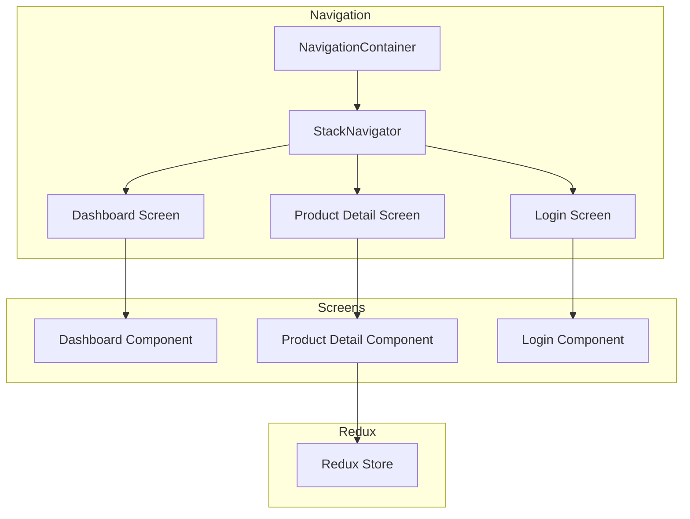

    

    <b>Automatic Architecture Diagrams from Code</b> 
    <a href="https://github.com/swark-io/swark">GitHub</a> • <a href="https://swark.io">Website</a> • <a href="mailto:contact@swark.io">Contact Us</a>

## Usage Instructions

1. **Render the Diagram**: Use the links below to open it in Mermaid Live Editor, or install the [Mermaid Support](https://marketplace.visualstudio.com/items?itemName=bierner.markdown-mermaid) extension.
2. **Recommended Model**: If available for you, use `claude-3.5-sonnet` [language model](vscode://settings/swark.languageModel). It can process more files and generates better diagrams.
3. **Iterate for Best Results**: Language models are non-deterministic. Generate the diagram multiple times and choose the best result.

## Generated Content
**Model**: GPT-4o - [Change Model](vscode://settings/swark.languageModel)  
**Mermaid Live Editor**: [View](https://mermaid.live/view#pako:eNp9U8FugzAM_ZUo5_YHOOxSjtM0jd2aHlziQrTioJBMm6r--7KELRQCOdnPz7LfM9x4rSXyggtqDPQtey8FMf8Gd47AC3yqBqzSFAu_L2EHTRYUoUnFykL9MTL0BH_WjaKqNoh0DDGLySlRShjaswYjR9p_vqS-Gi1dbUv0468jfcRYBJc9mbXZfv-0uvEjHqgTEZu8mZJNbkZK5CNJQbNzxPqQ8Wzi1kF3vSYku2bY3KpcQ5A6XipXn0l8lL15qKXq7FeSDF-34w2l-0rdIa28sXgMIQvxmgthQGqZTOE73qHpQEn_a9wEty12KHjBBJd4AXe1gt89yfUSLJYK_DYdL6xxuOPgrK6-qf7LjXZNy4sLXAe8_wDIdiE-) | [Edit](https://mermaid.live/edit#pako:eNp9U8FugzAM_ZUo5_YHOOxSjtM0jd2aHlziQrTioJBMm6r--7KELRQCOdnPz7LfM9x4rSXyggtqDPQtey8FMf8Gd47AC3yqBqzSFAu_L2EHTRYUoUnFykL9MTL0BH_WjaKqNoh0DDGLySlRShjaswYjR9p_vqS-Gi1dbUv0468jfcRYBJc9mbXZfv-0uvEjHqgTEZu8mZJNbkZK5CNJQbNzxPqQ8Wzi1kF3vSYku2bY3KpcQ5A6XipXn0l8lL15qKXq7FeSDF-34w2l-0rdIa28sXgMIQvxmgthQGqZTOE73qHpQEn_a9wEty12KHjBBJd4AXe1gt89yfUSLJYK_DYdL6xxuOPgrK6-qf7LjXZNy4sLXAe8_wDIdiE-)

